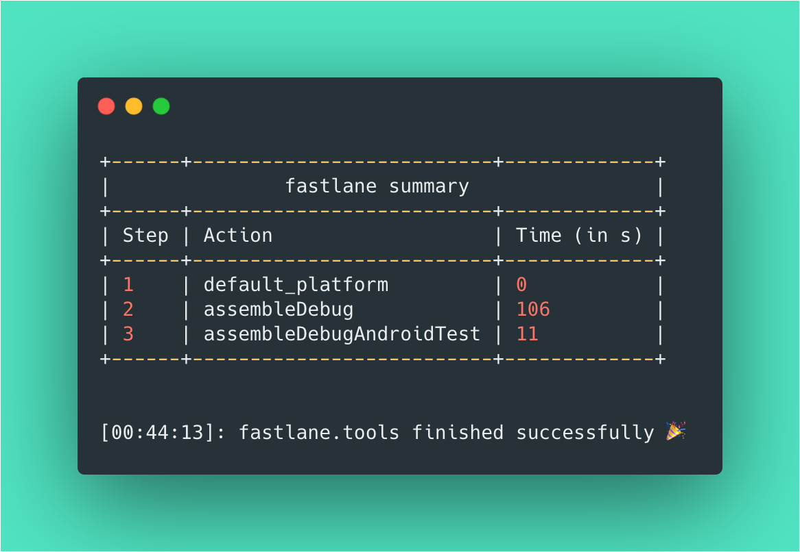
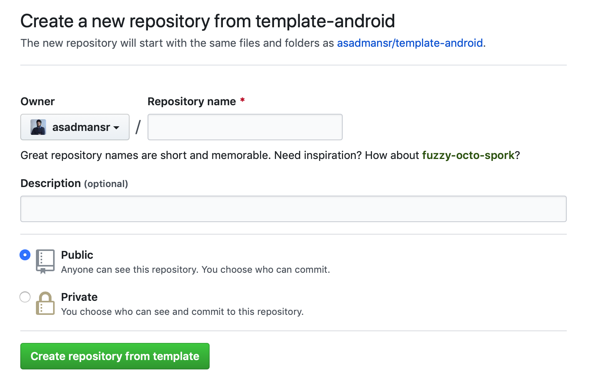

# Android Template

A GitHub template to start building Android applications with Fastlane and GitHub Actions.

 

## Get Started

To get started with this template, create a repository with this template and then add the Android application folder. Follow the steps below.

1. Click on `Use this template`

2. Enter details on your new repository. The new repository will automatically include the files from this template repository.

3. Git clone your new repository on your local machine.

4. Open Android Studio and create a new project. Select the folder you just cloned in the save location. If you already have an Android project, copy over the files into the cloned folder.

5. Git push your changes to the remote repository.

Congratulations. You have successfully set up your Android development environment with Fastlane and GitHub Actions.

 

## Fastlane

Fastlane is a tool to automate any tedious tasks in building, testing and deploying mobile applications. In this template, the fastlane template is set up to run specific gradle commands locally and on the GitHub Actions continuous integration (CI) pipeline.

To get started with fastlane, refer to the [Fastlane Summary](docs/fastlane.md).

 

## GitHub Actions

GitHub Actions allows the creation of custom workflows within the GitHub repository. These custom workflows can automate specific tasks within GitHub and build out a continuous integration and continuous deployment (CI/CD) pipeline. With this template, the CI pipeline is set up to validate new changes on pull requests to the master branch.

To get started with GitHub Actions, refer to the [GitHub Actions Summary](docs/github-actions.md).